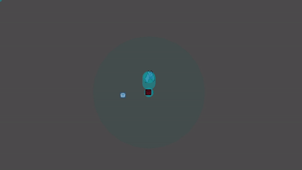
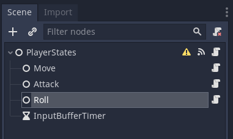
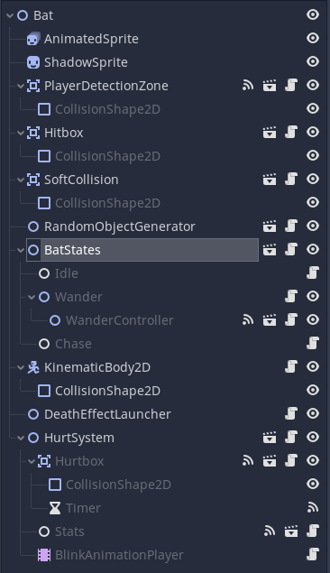
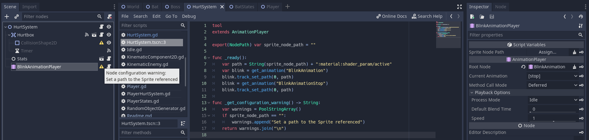

# Heartbeast's Action RPG tutorial extended and some component-based Godot 

## Intro
Like many, I've made my first steps in Godot following [this incredible tutorial](https://www.youtube.com/playlist?list=PL9FzW-m48fn2SlrW0KoLT4n5egNdX-W9a). I've also played with it a little and added a few extensions that I thought some would like to see. Then I wanted to really test Godot's ability to manage larger projects (without starting head first a large project), so I tried to implement some design patterns and my idea of what would be a manageable code base.
Namely, Godot Nodes seem perfect for implementing some component-based design, so I will talk about that here.
Finally, although I work in computer science I am very much a beginner in video game programming, so with this project I also hope to engage conversations with experienced programmers on video game architecture.

## Gameplay Addons

 - Game Over screen on player death, press a key to restart
 - Healing hearts appearing on the destruction of ennemies and grass
 - A fearsome boss ! 
 - An input buffer
 
 
 
 The boss with its quickly put together intro cutscene

## Small Tests
One thing I find really cool in Godot is the ability to create little scenes to only test a small part of your game. I created a test scene for the boss encounter that is still fully playable. For testing the bat's behavior, I have created a scene instantiating a bat and displaying some info about the bat's state and simulating a player with the mouse.



A simple bat tester controlled with the mouse.

## Design patterns
### Document with ~~code~~ the editor
A very powerful guideline when you are coding is that the code should be self explicit, or as self explicit as possible. If the documentation is complicated, it may be that the code is badly written. Something I really enjoy in Godot is that they take this one step further: the scene should be as self explicit as possible, and a coworker or future you should understand most of what is happening without having to look into your scripts. In my opinion this is the main design paradigm that should drive the choice of other patterns.

### State Machine
Both the Player and Bats have states that cause different behaviors: for example, the player cannot attack when he is in the "roll" state. It can be useful to isolate these behaviors in separate nodes to keep the code clear. In Godot, this is even more interesting if you can list the possible states that a player can be in as nodes in your scene. 
Each state typically has methods
 - enter() when we switch to this state
 - exit() when we switch from this state
 - process_state() the bulk of the work
 - handle_event() to call a change of state in certain case e.g. roll_input causes the switch from Idle to Roll

This enabled me to easily implement the Boss's behavior as different states, as well as the Player's input buffer. Check it out in the project !

 

A basic state machine for our player.

### Composition over inheritance
From [Wikipedia](https://en.wikipedia.org/wiki/Composition_over_inheritance): **Composition over inheritance** in [object-oriented programming](https://en.wikipedia.org/wiki/Object-oriented_programming "Object-oriented programming") (OOP) is the principle that classes should achieve [polymorphic](https://en.wikipedia.org/wiki/Polymorphism_(computer_science) "Polymorphism (computer science)") behavior and [code reuse](https://en.wikipedia.org/wiki/Code_reuse "Code reuse") by their [composition](https://en.wikipedia.org/wiki/Object_composition "Object composition") (by containing instances of other classes that implement the desired functionality) rather than [inheritance](https://en.wikipedia.org/wiki/Inheritance_(computer_science) "Inheritance (computer science)") from a base or parent class.[[2]](https://en.wikipedia.org/wiki/Composition_over_inheritance#cite_note-2) This is an often-stated principle of OOP, such as in the influential book _[Design Patterns](https://en.wikipedia.org/wiki/Design_Patterns "Design Patterns")_ (1994).[[3]](https://en.wikipedia.org/wiki/Composition_over_inheritance#cite_note-3).
The wikipedia page explains this really well with examples, you should have a look.

Godot seems a bit weird in this regard. On the one hand it seems to be designed with this principle at the center, with each node providing added functionality to a scene as a component. On the other I had to jump over some hurdles to make it work "my way". But lets see some examples:

#### Bat
I had fun making the bat scene as a fully component based scene. What I mean by that is that the parent node in the scene is simply a Node2D without any script attached to it, and all functionality is added by attaching components nodes to the parent. Again, this is to promote future code reusability and to make a self documenting scene.



The whole behavior of the bat scene is well summed up with its component nodes

 - **Hurt system**: In the tutorial, we have a "system" of nodes that work together and occur in both the bat scene and the player scene (and in this project in the Boss too). These nodes are the Hurtbox, the Stats, and the BlinkAnimationPlayer. I figured that every enemy and the players, as well as maybe some game props like barrels, destrutible walls would have health points, as well as a blinking "hurt" animations. In each of these separate scenes, we do not want to have to connect always the same signals and write always this same code:

```
func _ready():
	blink_animation_player.play("BlinkAnimationStop")

func _on_Hurtbox_area_entered(area):
	stats.health -= area.damage

func _on_Hurtbox_invincibility_started():
	blink_animation_player.play("BlinkAnimation")	

func _on_Hurtbox_invincibility_stopped():
	blink_animation_player.play("BlinkAnimationStop")
```
So a separate component scene is interesting. There is one tricky part, though: the BlinkAnimationPlayer needs a reference to a Sprite (in case of the player) or AnimatedSprite (in case of the bat) to make it blink. We could put the sprite in the HurtSystem scene, but I think it is not logical to have a sprite in the HurtSystem: imagine that you already have a scene, and you want the *added* functionality of the HurtSystem. You should be able to add the HurtSystem node without moving or deleting other nodes from the parent scene.

This leads to an interesting subject. We want to add a dependency: the BlinkAnimationPlayer needs a reference to a node that is not in its own scene. We could write this dependency in the documentation, but it is a bit easy to overlook, so we should make that clear directly in the editor.
Thankfully, Godot has a clean way of doing this. First, the reference can be written as an export variable, so that it can be set directly in the editor. Then, we can make the editor display a warning when this reference is not set, so that the dependency is clearer, using the _get_configuration_warning() callback.



Here, we see on the right the ability to set the remote reference using an export variable in the editor, as well as the editor warning that is displayed when this reference is not set. The code to enable this in the editor is in the center.

(As an aside, it was tricky to get the AnimationPlayer to work when it references a node that is not present in the current scene, that we will call an abstract node. First, you cannot create a property track on an abstract node, so you have to load a pre-made Animation. The path to the real, instanciated property can be added at runtime using the track_set_path() method. Second, an Animation is a resource shared between all instances of the AnimationPlayer, so if you use the track_set_path() method, you are in fact changing the path for all AnimationPlayers. You have to click the make sub-resources unique button to make everything work properly.)

 - **DeathEffectLauncher**: This is again behavior that is used several times in the codebase: delete the present node and launch a death effect. It can be again factorized as a component, and it makes it crystal clear in the node hierarchy that this behavior is part of the scene.
 
 - **KinematicBody Component**: Normally, you would say that a Bat is a class extending the KinematicBody2D class to have access to cool physics behavior. Maybe this is taking my endeavor too far, but I figured "why would a bat BE a KinematicBody more than it IS a sprite ?". In a component based architecture, the question does not arise: a bat HAS (is partly composed of) a KinematicBody and it HAS a sprite.
 
 The problem is that the KinematicBody should impose its movement to the parent node, so I had to define a KinematicComponent2D class, inheriting from KinematicBody2D, that transfers calls to the base class, but pushed its transform to a remote node as such:
````
func move_and_slide(linear_velocity: Vector2, up_direction: Vector2 = Vector2( 0, 0 ),
 stop_on_slope: bool = false, max_slides: int = 4, floor_max_angle: float = 0.785398,
 infinite_inertia: bool = true) -> Vector2:
	var ret: Vector2 = .move_and_slide(linear_velocity, up_direction, stop_on_slope,
								max_slides, floor_max_angle, infinite_inertia)
	var new_transform = get_global_transform()
	remote_node.set_global_transform(new_transform)
	set_transform(base_transform)
	return ret
````
 - **BatStates**: A state machine handling all processing depending on the state of the bat. It has 3 nodes/states: Idle, Wander, Chase. For better node management the WanderController node can be made a child node of the Wander state node.

### New! Instancing with signals and autoload signals
**Instancing with signals**: A good practice saying in Godot is "call down, signal up". get_parent() is used in the base tutorial to create elements that will survive the calling elements. For example, when grass is cut, we instantiate the "grass cut" effect but cannot make it a child of the grass scene as the grass scene is being freed. We use get_parent().add_child() to effectively create a scene that is a sibling of the grass scene. In Godot's documentation, though, they advise [instancing with signals](https://docs.godotengine.org/en/stable/tutorials/misc/instancing_with_signals.html). The idea is that instead of the grass placing the "grass cut" effect in the tree on its own, it sends a signal containing the effect, asking "someone" to care and to placing the effect. Indeed, the parent node may not exist (if you are testing your scene independently and it has no parent), or it may not be the best node to parent the newly created nodes. Now it is a little cumbersome as "someone" has to connect to all the signals of the different elements having this kind of behavior: grass cut effect, enemies defeated effect, player hit sound...

**Autoload signals**: This is another pattern that comes in handy here. The idea is to have a signal that is declared in an autoload script. This way, anybody can send this signal or subscribe to these signals. For our previous problem, each element wanting to add a node to the tree, but not in its hierarchy can send it via this global signal. The node in charge of instantiating these new nodes simply has to connect once to this single signal, instead of knowing about all the different instances of this behavior.

### New! Inherited scenes
I have talked before about composition over inheritance, but that does not mean that all inheritance is bad! I think it is interesting to combine the two, for example by inheriting an ensemble of components. We can define a basic Enemy scene, with its AnimatedSprite, DeathEffectLauncher, HurtSystem, etc... components that we think will be reused as a set to define a plethora of enemies in the future. Then, we can make our Bat and Boss scenes as **inherited scenes** of the Enemy scene. Now, by adding a new component to this scene, all Enemies will have new common behavior!

### New! Custom Resources
A good design principle is to decouple data from processes. First, this allows more code reuse if you are able to describe a new behavior simply as new data given to a previously-written system. Second, this enables people that do not know programming to participate in code development. Third, in some cases this can be used by the engine to [make the code run faster](https://en.wikipedia.org/wiki/Data-oriented_design). In our game, we have both a Game Over screen and a Congratulations screen, and they share a lot of behavior: they are made of a text over a colored background, they fade in, and when you press a key the game reloads from the start. What differentiates them is only data: the text string, and the color of the background. This is perfect for using custom resources. First, we create a script to declare a class inheriting from Resource. In this class, we declare a color variable and a text variable. Now, we can create two resources containing the data for our Game Over and Congratulations screens. Depending on the situation, the ResultsDisplay simply has to load one resource or the other, and all its code can be reused!

## Outro 
Thank you for reading! I hope that this will be useful to people having just finished Heartbeast's tutorial and looking for something to follow up with. If you have any reflections to share about the design patterns presented here, I will be more than happy to discuss and learn on the discussions page https://github.com/BimDav/actionRPG/discussions/1 !
